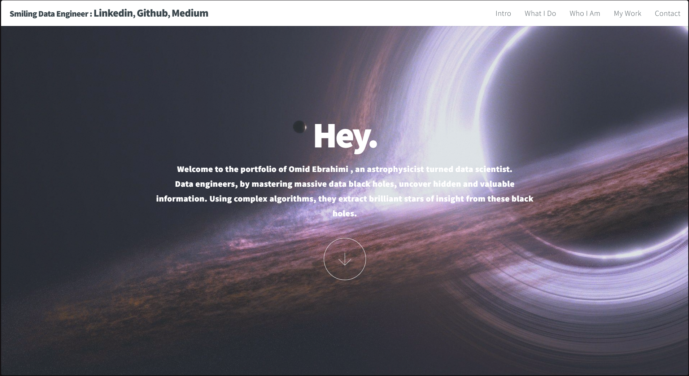

# Developer Portfolios on `github.io`

Welcome to the ultimate list of **Developer Portfolios** hosted on GitHub Pages (`github.io`)! 🌐✨
[My LINKEDIN](https://linkedin.com/in/omidebrahimi1)

## About This Repository
This repository is a curated collection of developer portfolios designed to inspire and help you create or improve your personal portfolio. These portfolios showcase creativity, technical skills, and diverse approaches to web development, all hosted on GitHub Pages.

If you've built a portfolio and hosted it on `github.io`, we'd love to feature it here! Open a [Pull Request](./CONTRIBUTING.md) to add your portfolio to this list.

# Sample Screenshots




## Portfolios

| Developer Portfolio                  | Developer Portfolio                                |
|--------------------------------------|----------------------------------------------------|
| [Random Portfolio](https://s111ew.github.io/random-button-redirector/) | [s111ew.github.io](https://s111ew.github.io/random-button-redirector/) |
| [Aditya Kumar Gupta](https://aditya30051993.github.io/my-portfolio) | [aditya30051993.github.io](https://aditya30051993.github.io/my-portfolio) |
| [Adityakumar Sinha](https://aditya113141.github.io) | [aditya113141.github.io](https://aditya113141.github.io) |
| [Ahmad Almory](https://ahmedalmory.github.io/portfolio) | [ahmedalmory.github.io](https://ahmedalmory.github.io/portfolio) |
| [Akash Balasubhramanyam](https://akashblsbrmnm.github.io) | [akashblsbrmnm.github.io](https://akashblsbrmnm.github.io) |
| [Akhil Surapuram](https://surapuramakhil.github.io) | [surapuramakhil.github.io](https://surapuramakhil.github.io) |
| [Alestor Aldous](http://alestor123.github.io) | [alestor123.github.io](http://alestor123.github.io) |
| [Aloys Dillar](https://trolologuy.github.io) | [trolologuy.github.io](https://trolologuy.github.io) |
| [Aman Anku](http://amananku26.github.io) | [amananku26.github.io](http://amananku26.github.io) |
| [André de Faria](https://andredfaria.github.io/) | [andredfaria.github.io](https://andredfaria.github.io/) |
| [Anil Khatri](https://imkaka.github.io) | [imkaka.github.io](https://imkaka.github.io) |
| [Anton Bojko](https://mrtoxas.github.io/cv/portfolio/) | [mrtoxas.github.io](https://mrtoxas.github.io/cv/portfolio/) |
| [Antonio Ferreiro](https://toniferr.github.io) | [toniferr.github.io](https://toniferr.github.io) |
| [Anurag Hazra](https://anuraghazra.github.io) | [anuraghazra.github.io](https://anuraghazra.github.io) |
| [Ariel Andrade](https://sudoariel.github.io) | [sudoariel.github.io](https://sudoariel.github.io) |
| [Arpit Sharma](https://yesarpit.github.io) | [yesarpit.github.io](https://yesarpit.github.io) |
| [Arsalan Shakil](https://arsalanshakil.github.io) | [arsalanshakil.github.io](https://arsalanshakil.github.io) |
| [Arslan Sarfraz](https://arslansarfraz.github.io/portfolio/) | [arslansarfraz.github.io](https://arslansarfraz.github.io/portfolio/) |
| [Arup Mandal](https://arupmandal.github.io) | [arupmandal.github.io](https://arupmandal.github.io) |
| [Auroob Ahmad](https://auroob.github.io/dev-port) | [auroob.github.io](https://auroob.github.io/dev-port) |
| [Bekah Hawrot Weigel](http://bekahhw.github.io) | [bekahhw.github.io](http://bekahhw.github.io) |
| [Benny Carlsson](https://bennycarlsson.github.io/MyPortfolio-Hacktoberfest2019/) | [bennycarlsson.github.io](https://bennycarlsson.github.io/MyPortfolio-Hacktoberfest2019/) |
| [Bhushan Borole](https://bhushan-borole.github.io) | [bhushan-borole.github.io](https://bhushan-borole.github.io) |
| [Chetanya Kandhari](https://availchet.github.io) | [availchet.github.io](https://availchet.github.io) |

*(...and many more portfolios!)*

---

## How to Clone This Repository
To have access to all the featured portfolios, you can clone this repository by running the following command in your terminal:

```bash
git clone https://github.com/AsmrCodeZ-YT/Pro-Portfolio-Website.git
```

After cloning, you can explore the featured portfolios locally or navigate directly to their hosted links.

---

## Contact
If you have any questions or suggestions, feel free to reach out:

- Follow me in : [LINKEDIN](https://linkedin.com/in/omidebrahimi1)

